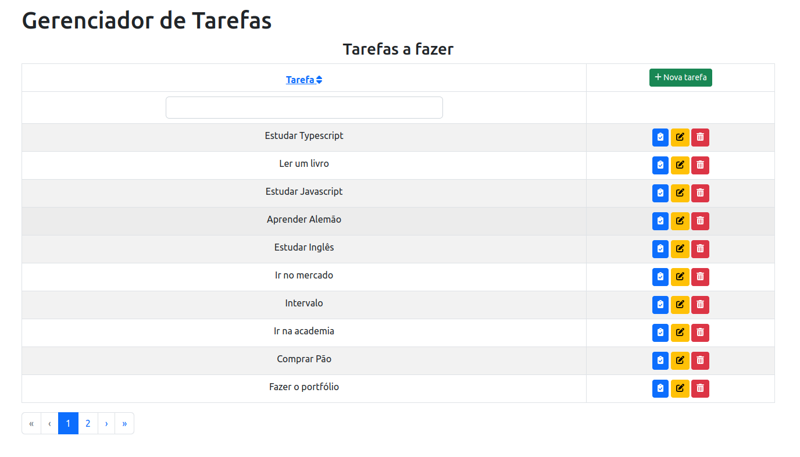

<div align="center">
  <h1>Gerenciador de Tarefas</h1>
</div>

<div align="center" >
  
</div>

Gerenciador de Tarefas, permite cadastrar, marcar como concluídas, editar e exluir as tarefas.

## ✔️ Técnicas e tecnologias utilizadas

Lista de tecnologias que foram usadas nesse projeto:


## 🛠️ Abrir e rodar o projeto

Para abrir e rodar o projeto, entre na pasta do frontend execute npm i para instalar as dependências e npm start para iniciar o projeto.

Depois, acesse <a href="http://localhost:3000/">http://localhost:3000/</a> no seu navegador.

### Usando Docker

Se tiver o docker-compose instalado no computador, após clonar o projeto basta rodar o comando abaixo para criar e iniciar os contêineres:

```
docker-compose up -d
```

Para paralisar e remover todos os contêineres use o comando:

```
docker-compose down
```

### Projeto em produção
Este projeto pode ser visualizado neste [link](https://grazziano.github.io/gerenciador-de-tarefas/).

## 📚 Mais informações

Entre em contato pelo [linkedin](https://www.linkedin.com/in/grazziano-fagundes/).

<div align="center">
  <small>Grazziano Borges Fagundes - 2022</small>
</div>